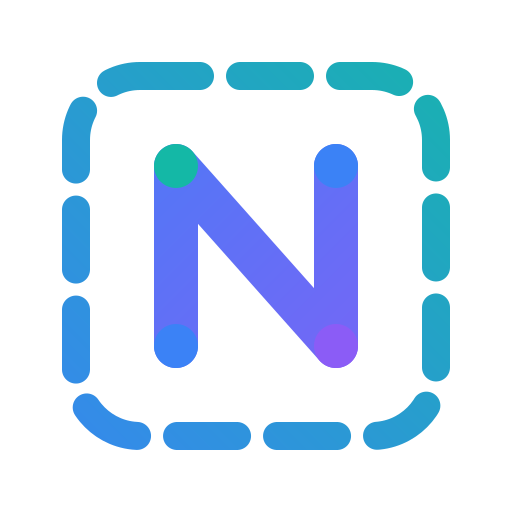

<div align="center">
  
  <h1>Real-Time Collaborative Whiteboard</h1>
  <p>A high-performance, real-time interactive whiteboard application inspired by Miro, built with Next.js 16, React 19, Convex, Liveblocks, Clerk, and Stripe.</p>

  [](https://nextjs.org/)
  [](https://react.dev/)
  [](https://www.typescriptlang.org/)
  [](https://convex.dev/)
  [](https://liveblocks.io/)
  [](https://stripe.com/)
</div>

---

## Overview

This repository features a full-stack, enterprise-grade real-time whiteboard canvas designed for multi-user collaboration. Users can create organizations, manage whiteboards, draw shapes, write sticky notes, edit text, collaborate in real time with live multiplayer cursors, and upgrade to premium organization tiers via Stripe billing.

## Key Features

- **Interactive Canvas Engine:**
  - **Vector Tools:** Freehand pencil drawing powered by `perfect-freehand`, rectangles, ellipses, text elements, and sticky notes.
  - **Transform & Selection:** Real-time object drag-and-drop, bounding box resize handles, multi-selection, z-index layering (bring to front / send to back), and color picking.
- **Multiplayer Real-Time Sync:**
  - Powered by Liveblocks for instant state synchronization, multi-user presence, active selection highlights, and live cursors.
- **Organization & Search:**
  - Organization switcher with Clerk integration, board search, filtering, and favoriting capability.
- **Backend & Reactive Database:**
  - Convex serverless backend providing real-time queries, mutations, database schema constraints, and HTTP endpoints.
- **Authentication & Security:**
  - Complete auth flow via Clerk, synchronized with Convex using `ConvexProviderWithClerk`.
- **Monetization & Subscriptions:**
  - Stripe checkout integration and webhook handling for organization pro plans.

---

## Tech Stack

| Domain | Technology |
| :--- | :--- |
| **Framework** | Next.js 16 (App Router), React 19 |
| **Language** | TypeScript |
| **Real-time State** | Liveblocks (`@liveblocks/client`, `@liveblocks/react`) |
| **Backend & DB** | Convex (`convex/` reactive backend) |
| **Authentication** | Clerk (`@clerk/nextjs`) |
| **Payments** | Stripe API & Webhooks |
| **Styling & UI** | Tailwind CSS v4, Radix UI, Shadcn UI, Lucide Icons |
| **State Management** | Zustand, `usehooks-ts` |
| **Freehand Engine** | `perfect-freehand` |

---

## Architecture & Directory Structure

```text
├── app/                  # Next.js App Router (dashboard routes, board canvas page, API endpoints)
├── components/           # Reusable UI primitives, modal providers, and canvas sub-components
├── convex/               # Convex database schema, backend functions, and HTTP webhook listeners
├── hooks/                # Custom React hooks for canvas tools, API mutations, and state management
├── lib/                  # Shared utility functions and configuration constants
├── providers/            # App context providers (Convex + Clerk, Modals)
├── store/                # Zustand client-side state stores
└── types/                # TypeScript interface declarations for canvas layers, tools, and presence
```

---

## Environment Configuration

Create a `.env.local` file in the root directory and configure the following variables:

```bash
# Convex Deployment
NEXT_PUBLIC_CONVEX_URL=https://<your-convex-deployment>.convex.cloud

# Clerk Authentication
NEXT_PUBLIC_CLERK_PUBLISHABLE_KEY=pk_test_...
CLERK_SECRET_KEY=sk_test_...

# Liveblocks Real-Time
LIVEBLOCKS_SECRET_KEY=sk_liveblocks_...

# Stripe Payments & Webhooks
STRIPE_API_KEY=sk_test_...
STRIPE_WEBHOOK_SECRET=whsec_...
```

> [!NOTE]
> Environment variables are validated at runtime using the `requireEnvVar` helper located in `lib/utils.ts`.

---

## Getting Started

### Prerequisites

Ensure you have Node.js (v20+ recommended) and `npm` installed.

### Installation

Clone the repository and install project dependencies:

```bash
git clone https://github.com/BhushanLagare7/nextjs16-miro-clone.git
cd nextjs16-miro-clone
npm install
```

### Local Development

1. **Start the Next.js frontend server:**
   ```bash
   npm run dev
   ```

2. **Start the Convex backend sync engine (in a separate terminal):**
   ```bash
   npx convex dev
   ```

3. **(Optional) Listen for Stripe webhooks:**
   ```bash
   npm run stripe:listen
   ```

Open [http://localhost:3000](http://localhost:3000) in your browser to view the app.

> [!IMPORTANT]
> Both `npm run dev` and `npx convex dev` must be running simultaneously for real-time board creation and database interactions to work properly.

---

## Available Scripts

| Command | Description |
| :--- | :--- |
| `npm run dev` | Launches Next.js local development server |
| `npx convex dev` | Connects local client to reactive Convex backend |
| `npm run build` | Builds optimized Next.js production bundle |
| `npm run start` | Starts Next.js production server |
| `npm run lint` | Runs ESLint checks across the codebase |
| `npm run lint:fix` | Automatically fixes code linting errors |
| `npm run stripe:listen` | Forwards Stripe webhooks to local Convex server |
| `npm run stripe:trigger` | Triggers a simulated Stripe checkout completed event |
